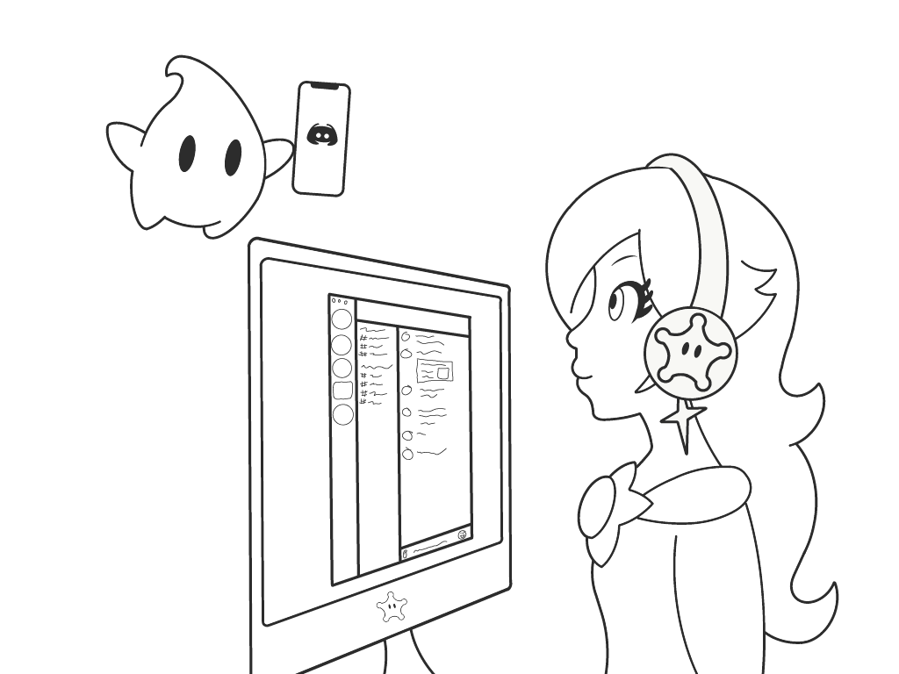

# RosalinaBot
**A Discord Bot for Nintendo fans**

    

RosalinaBot keeps tracks of your friends' Nintendo friend codes through Discord! Equipped with a coin, a dice, and communication with the stars (*definitely*) for maximum obligatory bot features.

## Features
* Support for Nintendo Switch and Nintendo 3DS Friend Codes
  * Send and recieve your Nintendo Switch and Nintendo 3DS friend codes with your Discord friends
* Dice
  * Use `r!dice` or `r!die` to roll a die. A great alternative to settling it in Smash!
* Coin Flipping
  * Use `r!coin` to flip a coin. Who knows? Maybe it'll land on its side!
* 8 Ball
  * Use `r!8ball [Yes or No Question]` to seek answers from the cosmos.
* Privacy Settings
  * Customize whether your friends can request your individual friend codes.
    * (The alternative is you sending your code to chat yourself.)

## Instructions
### Sharing friend codes
To share your friend code with people in your server, or just keep it handy on Discord, use either `r!setSwitchCode` or `r!set3DSCode` to store your Nintendo Switch friend code or Nintendo 3DS friend code respectively. Example usage is below for both commands.

`r!setSwitchCode SW-1234-5678-9000`
`r!set3DSCode 1234-5678-9000`

Note that dashes are required and the commands are not case sensitive. You should recieve a confirmation message if it is successful. By default, your friend codes are private. In order for others to see them, you must type `r!switchCode` or `r!3DSCode` to retrieve your friend codes. If you set your friend codes to public, others in a server with RosalinaBot may use `r!switchCode @[YOU]` or `r!3DSCode @[YOU]` to retrieve your friend codes.

### Privacy Settings
By default, any of your friend codes will be set to private. The only time RosalinaBot will send your friend codes to a chat is if you and only you use the `r!switchCode` or the `r!3DSCode` commands. To check these settings at anytime, use `r!settings`.

To change a privacy setting, follow this format `r!settings [PLATFORM]Code [PRIVACY]`. Replace `PLATFORM` with either `switch` or `3DS` and `PRIVACY` with either `PUBLIC` or `PRIVATE`. For example, typing `r!settings switchCode PUBLIC` will set your Nintendo Switch friend code to public. Likewise, typing `r!settings 3DSCode PRIVATE` will set your Nintendo 3DS friend code to private.
